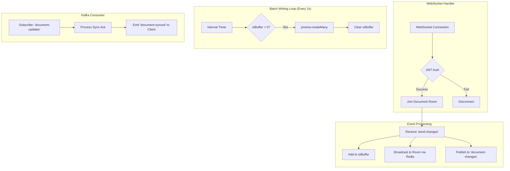
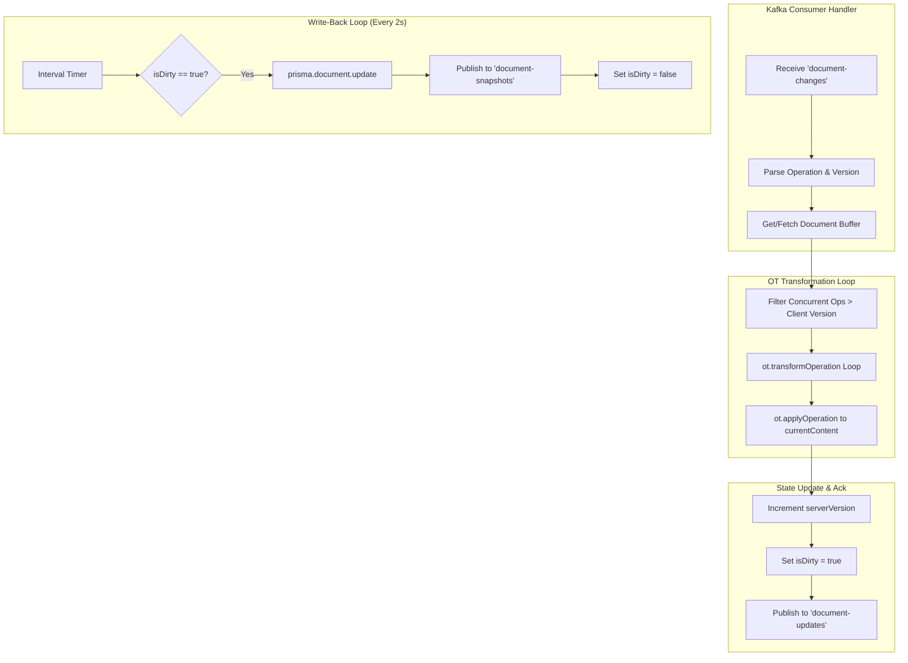
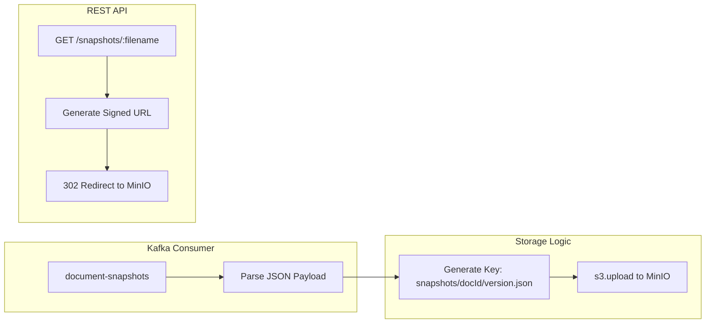
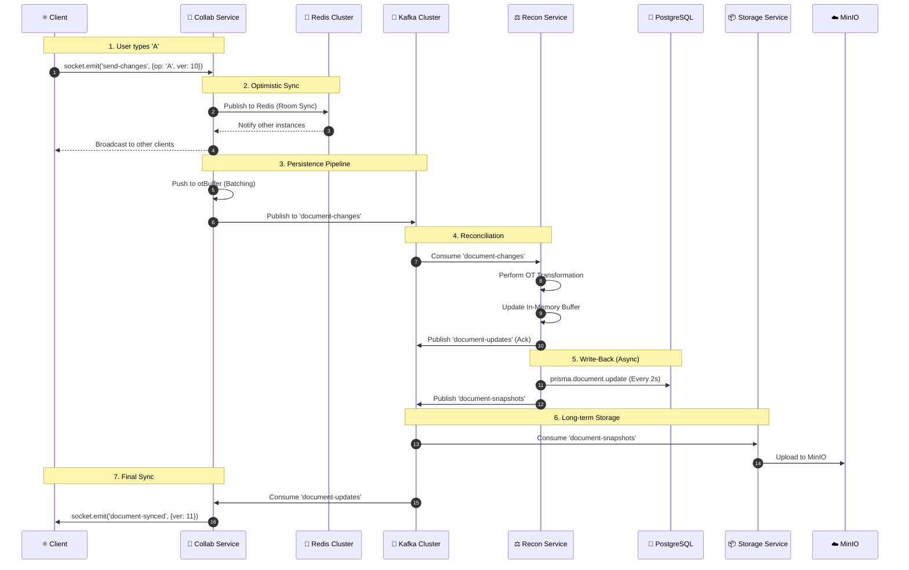
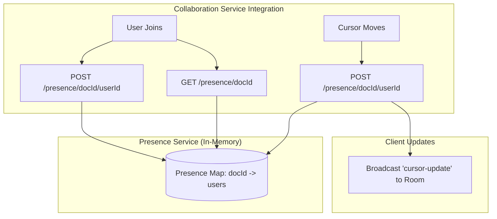
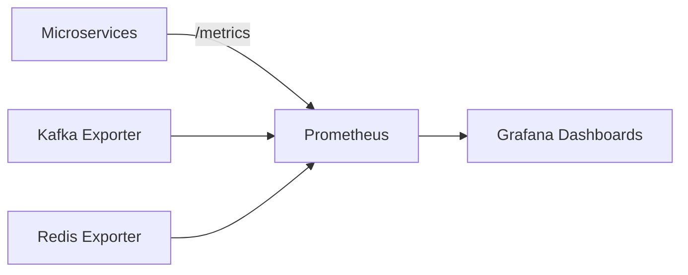

# 🏗️ Distributed Collaborative Text Editor: Technical Architecture Deep-Dive

This document provides an exhaustive, bit-by-bit technical breakdown of the system's architecture. It focuses on the internal logic, data structures, and distributed coordination mechanisms that enable real-time, consistent collaboration at scale.

---

## 1. 🤝 Collaboration Service: Internal Logic & Data Flow

The Collaboration Service is the entry point for all real-time user interactions. It manages stateful WebSocket connections and coordinates with Redis and Kafka.

### 🧩 Internal Components & State
- **`otBuffer`**: An in-memory array that temporarily stores `OperationalTransform` records before they are flushed to the database.
- **`Socket.io Server`**: Handles the WebSocket lifecycle (connection, authentication, rooms).
- **`Redis Adapter`**: Synchronizes events across multiple service instances using a Redis Cluster.

### 🔄 Service Internal Logic Diagram

---

## 2. ⚖️ Reconciliation Service: The OT Engine

The Reconciliation Service is the "Source of Truth" for document consistency. It ensures that concurrent edits from different users are merged correctly.

### 🧩 Internal Components & State
- **`operationBuffers` (Map)**: A key-value store where the key is `documentId` and the value is a buffer object containing:
    - `operations`: The last 100 reconciled operations (for transformation history).
    - `currentContent`: The full, reconciled text of the document.
    - `serverVersion`: The latest version number.
    - `isDirty`: A flag indicating if the buffer needs flushing to the DB.

### ⚙️ OT Reconciliation Logic Diagram

---

## 3. 📦 Storage Service: Snapshot & Persistence

The Storage Service handles long-term persistence and point-in-time recovery.

### 🧩 Internal Logic
- **Kafka Consumer**: Subscribes to the `document-snapshots` topic.
- **MinIO Client**: Uploads document states as JSON blobs.

### 🔄 Snapshot Flow Diagram

---

## 4. 🧬 Life of an Edit: Bit-by-Bit Sequence

This diagram shows the exact path a single character takes through the distributed system.

---

## 5. 👤 Presence & Cursor Sub-Architecture

Presence is handled via a dedicated service to keep the Collaboration Service lightweight.

### 🧩 Presence Logic Diagram

---

## 6. 🛠️ Infrastructure: The Distributed Stack

The system is designed to be resilient and observable.

### ☸️ Kubernetes Cluster Architecture
- **StatefulSets**:
    - **Kafka**: Single-node broker (expandable) for event streaming.
    - **Redis Cluster**: 6-node cluster (3 Master, 3 Replica) for high availability and pub/sub.
    - **PostgreSQL**: Master-Replica architecture (`postgres-master`, `postgres-replica`) for data durability and read scaling.
- **Deployments**:
    - **Microservices**: Stateless deployments for `auth`, `collaboration`, `document`, `presence`, `storage`, and `reconciliation` services.
    - **API Gateway**: Central entry point for routing requests.
    - **Client**: React frontend served via Nginx.
- **Networking**:
    - **Nginx Load Balancer**: Layer 7 Ingress/LoadBalancer exposing the application to the outside world.
    - **Headless Services**: For stable network identities of stateful pods.

### 📊 Monitoring Pipeline

---

*This architecture ensures that even if a database write is delayed (via batching), the user experience remains real-time and consistent across all distributed nodes.*
