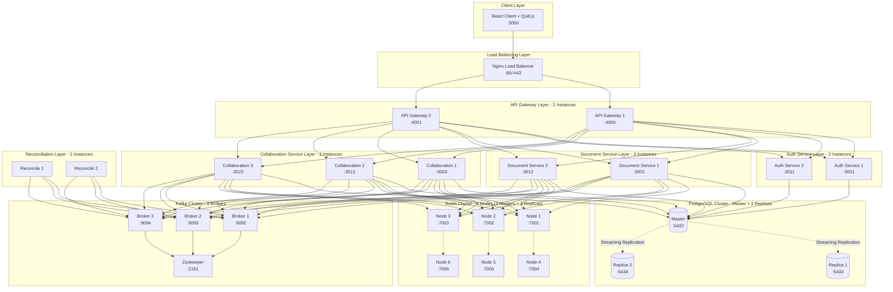
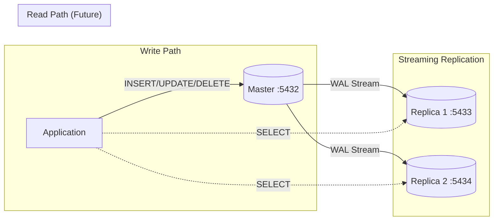
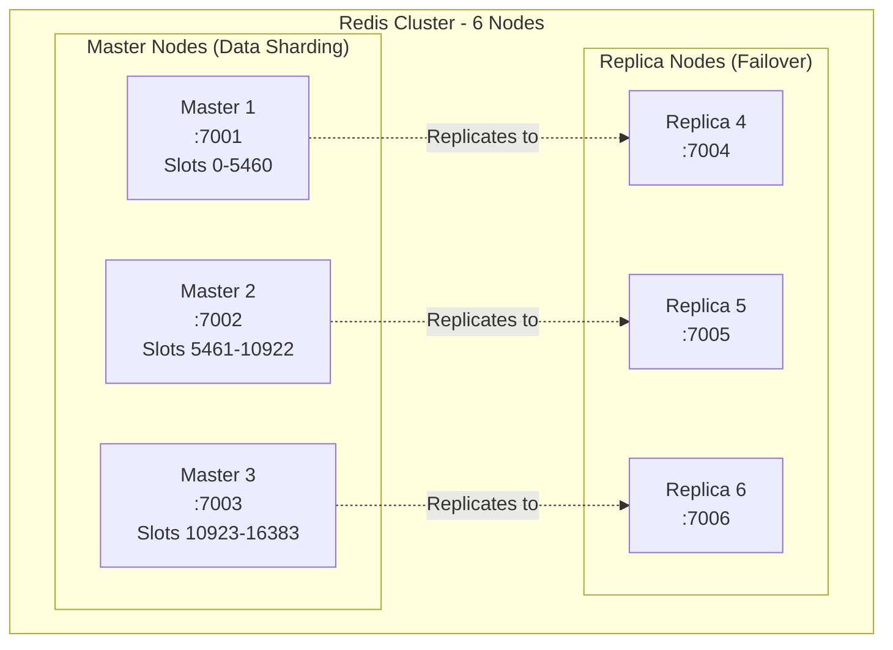
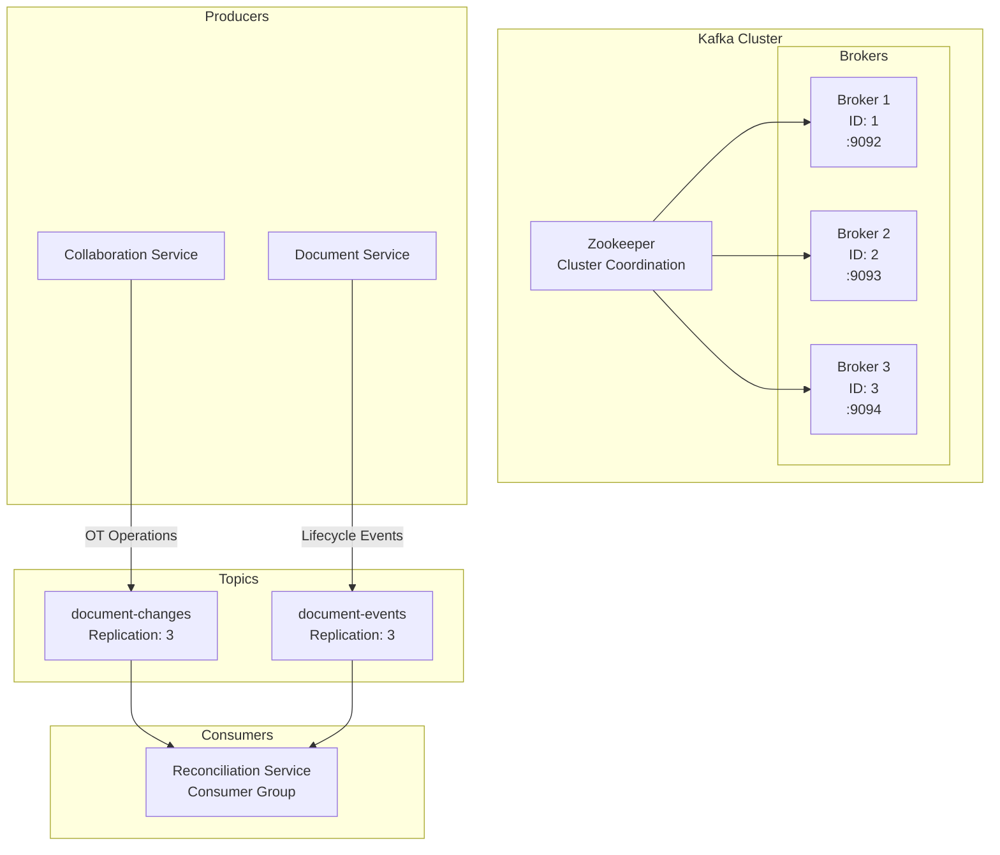
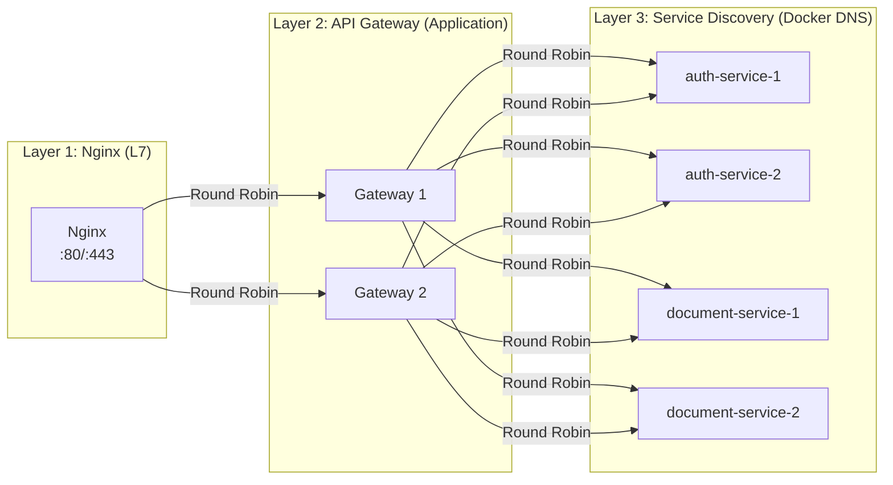
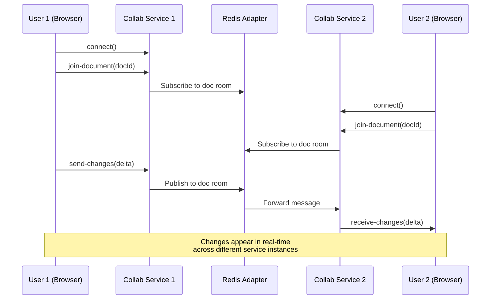
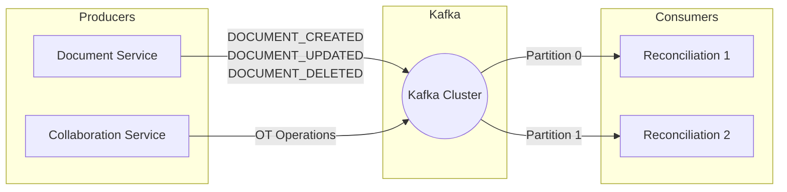

# Multi-User Distributed Text Editor
## Complete Technical Documentation

---

## 1. Executive Summary

A **production-grade real-time collaborative text editor** built on a **microservices architecture** implementing core distributed systems principles. The system enables multiple users to simultaneously edit documents with live synchronization, leveraging **27 containerized services** for horizontal scalability, fault tolerance, and high availability.

---

## 2. Complete Infrastructure Overview

### Container Count by Category

| Category | Count | Components |
|----------|-------|------------|
| **Database** | 3 | PostgreSQL Master + 2 Replicas |
| **Kafka Cluster** | 4 | 3 Brokers + Zookeeper |
| **Redis Cluster** | 7 | 6 Data Nodes + 1 Init Container |
| **API Gateways** | 2 | Gateway 1 + Gateway 2 |
| **Auth Services** | 2 | Auth 1 + Auth 2 |
| **Document Services** | 2 | Doc 1 + Doc 2 |
| **Collaboration Services** | 3 | Collab 1 + Collab 2 + Collab 3 |
| **Reconciliation Services** | 2 | Reconcile 1 + Reconcile 2 |
| **Load Balancer** | 1 | Nginx |
| **Client** | 1 | React Frontend |
| **Monitoring Tools** | 3 | Kafka UI, PgAdmin, Redis Commander |
| **Total** | **30** | **Full Distributed Stack** |

---

## 3. Architecture Diagram

---

## 4. Distributed System Capabilities - Deep Dive

### 4.1 Horizontal Scaling (Stateless Microservices)

| Service | Instances | Scaling Strategy |
|---------|-----------|------------------|
| API Gateway | 2 | Stateless, round-robin via Nginx |
| Auth Service | 2 | Stateless, JWT-based (no session state) |
| Document Service | 2 | Stateless + Redis cache |
| Collaboration Service | 3 | Redis Adapter for cross-instance pub/sub |
| Reconciliation Service | 2 | Kafka consumer group (partitioned) |

**How it works:**
- Each service instance is identical and interchangeable
- Nginx distributes incoming traffic across all gateway instances
- API Gateway further distributes to service instances using round-robin
- No sticky sessions required (except WebSocket - handled by Redis Adapter)

---

### 4.2 Database Replication (PostgreSQL)

**Configuration:**
- **Master (postgres-master:5432):** Handles all write operations
- **Replica 1 (postgres-replica-1:5433):** Streaming replication, read-only
- **Replica 2 (postgres-replica-2:5434):** Streaming replication, read-only
- **Replication Mode:** Asynchronous streaming (low latency, eventual consistency)

**Benefits:**
- **High Availability:** If master fails, a replica can be promoted
- **Read Scaling:** Read queries can be distributed to replicas (configurable via env vars `DB_REPLICA_1`, `DB_REPLICA_2`)
- **Disaster Recovery:** Replicas provide point-in-time recovery capability

---

### 4.3 Distributed Caching (Redis Cluster)

**Configuration:**
- **6 Nodes Total:** 3 Masters + 3 Replicas
- **Hash Slots:** 16,384 slots divided among 3 masters
- **Replication Factor:** 1 (each master has 1 replica)
- **Cluster Mode:** Enabled with automatic failover

**Use Cases:**
1. **Document Caching:** Hot documents cached to reduce database load
2. **Socket.IO Adapter:** Cross-instance WebSocket message broadcasting
3. **Session State:** Collaboration session data shared across instances

---

### 4.4 Message Queue (Apache Kafka)

**Configuration:**
- **3 Brokers:** kafka-1, kafka-2, kafka-3
- **Replication Factor:** 3 (topics replicated across all brokers)
- **Min In-Sync Replicas:** 1 (at least 1 replica must acknowledge)
- **Consumer Groups:** Reconciliation services share a consumer group for partition distribution

**Topics:**
| Topic | Producer | Purpose |
|-------|----------|---------|
| `document-changes` | Collaboration Service | Real-time OT operations |
| `document-events` | Document Service | Lifecycle events (create, update, delete) |

---

### 4.5 Load Balancing (Multi-Layer)

**Nginx Configuration:**
- Distributes traffic to API Gateway instances
- Health-check based routing (unhealthy instances excluded)
- WebSocket upgrade support for collaboration

**API Gateway Load Balancing:**
- Maintains list of service URLs from environment variables
- Round-robin selection across service instances
- Single point of entry for all client requests

---

### 4.6 Real-Time Collaboration (Socket.IO + Redis)

**Cross-Instance Communication:**
- Socket.IO uses Redis Adapter for pub/sub
- User 1 connected to Collab Service 1
- User 2 connected to Collab Service 2
- Both users see each other's changes instantly

---

### 4.7 Event-Driven Architecture

**Event Types:**
- `DOCUMENT_CREATED`: New document created
- `DOCUMENT_UPDATED`: Document content/title changed
- `DOCUMENT_DELETED`: Document removed
- `COLLABORATOR_ADDED/REMOVED`: Sharing changes

---

## 5. Fault Tolerance & High Availability

| Component | Failure Scenario | Handling Mechanism |
|-----------|------------------|-------------------|
| **Auth Service** | 1 of 2 instances fails | Nginx routes to healthy instance |
| **Document Service** | 1 of 2 instances fails | Gateway routes to healthy instance |
| **Collaboration Service** | 1 of 3 fails | User reconnects to another instance via Redis Adapter |
| **Reconciliation Service** | 1 of 2 fails | Kafka rebalances partitions to remaining consumer |
| **PostgreSQL Master** | Master fails | Manual failover to replica (or use Patroni) |
| **PostgreSQL Replica** | Replica fails | No impact (read queries can use other replica) |
| **Redis Node** | Master node fails | Cluster promotes replica automatically |
| **Kafka Broker** | 1 of 3 brokers fails | Other brokers continue (replication factor 3) |
| **Nginx** | Nginx fails | Single point of failure (add keepalived for HA) |

---

## 6. What's Implemented vs. What's Missing

### ✅ Implemented Capabilities

| Capability | Implementation Details |
|------------|------------------------|
| **Microservices Architecture** | 5 independent services with clear boundaries |
| **Horizontal Scaling** | Multiple instances of each service |
| **Database Replication** | PostgreSQL master + 2 streaming replicas |
| **Distributed Caching** | Redis Cluster (6 nodes, 3 masters + 3 replicas) |
| **Message Queue** | Kafka Cluster (3 brokers + Zookeeper) |
| **Real-time Sync** | Socket.IO with Redis Adapter |
| **Load Balancing** | Nginx (L7) + API Gateway (application) |
| **Service Discovery** | Docker DNS-based discovery |
| **Health Checks** | All services have Docker healthchecks |
| **API Documentation** | Swagger UI for Auth and Document services |
| **Containerization** | Full Docker Compose orchestration |
| **Monitoring Tools** | Kafka UI, PgAdmin, Redis Commander |

### ⚠️ Limitations & Missing Features

| Missing Feature | Impact | Recommended Solution |
|-----------------|--------|---------------------|
| **True CRDT/OT** | Last-write-wins for concurrent edits | Implement Yjs or Automerge |
| **Read-Replica Routing** | Replicas not used for reads | Implement read/write splitting |
| **Circuit Breakers** | Cascading failures possible | Add Resilience4j or Polly |
| **Distributed Tracing** | Hard to debug cross-service issues | Add Jaeger or Zipkin |
| **Centralized Logging** | Logs scattered across containers | Add ELK Stack or Loki |
| **Auto-Scaling** | Manual scaling only | Migrate to Kubernetes with HPA |
| **Service Mesh** | Limited observability | Add Istio or Linkerd |
| **OAuth/SSO** | Basic email/password auth only | Add Keycloak or Auth0 |
| **Rate Limiting** | No request throttling | Add rate limiting middleware |
| **Database Failover** | Manual replica promotion | Add Patroni or PgPool-II |

---

## 7. Technology Stack Summary

| Layer | Technology | Purpose |
|-------|------------|---------|
| **Frontend** | React, Quill.js | Rich text editing |
| **Real-time** | Socket.IO | WebSocket communication |
| **API Gateway** | Express.js + http-proxy-middleware | Request routing, load balancing |
| **Services** | Node.js, Express.js | REST APIs |
| **ORM** | Prisma | Database access |
| **Database** | PostgreSQL 15 | Primary data store |
| **Caching** | Redis 7 (Cluster) | Document caching, pub/sub |
| **Messaging** | Apache Kafka 7.5 | Event streaming |
| **Coordination** | Zookeeper | Kafka cluster management |
| **Load Balancer** | Nginx | Traffic distribution |
| **Container Runtime** | Docker | Service isolation |
| **Orchestration** | Docker Compose | Multi-container deployment |
| **API Docs** | Swagger/OpenAPI | Interactive API documentation |

---

## 8. Conclusion

This project demonstrates a **comprehensive distributed system** with:

- **27-30 containerized services** working in concert
- **True horizontal scaling** with multiple instances per service
- **Data redundancy** through PostgreSQL replication and Redis clustering
- **Async messaging** with a 3-broker Kafka cluster
- **Real-time collaboration** via Socket.IO with Redis Adapter
- **Multi-layer load balancing** (Nginx → API Gateway → Services)

The architecture is **production-ready** for moderate scale and provides a solid foundation for enterprise deployment with the recommended enhancements.
