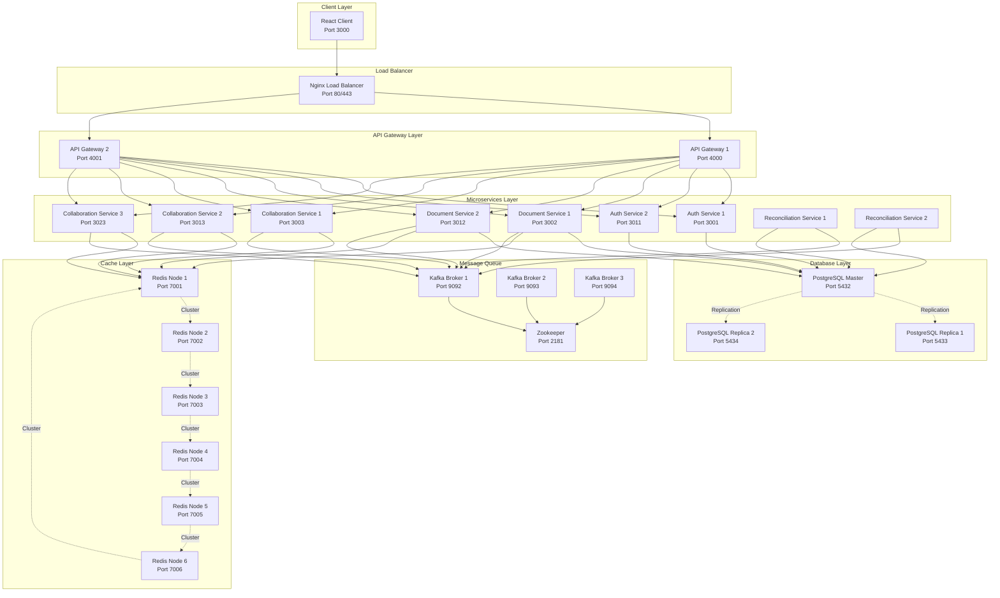

# Multi-User Distributed Text Editor - Architecture Documentation

## 📋 Table of Contents
1. [System Overview](#system-overview)
2. [Architecture Diagram](#architecture-diagram)
3. [Microservices](#microservices)
4. [Infrastructure Components](#infrastructure-components)
5. [Data Flow](#data-flow)
6. [Scalability & High Availability](#scalability--high-availability)
7. [Technology Stack](#technology-stack)
8. [Deployment Architecture](#deployment-architecture)
9. [Security](#security)

---

## System Overview

The Multi-User Distributed Text Editor is a **Google Docs clone** built with a **microservices architecture** designed for high scalability, fault tolerance, and real-time collaboration. The system supports multiple users editing documents simultaneously with operational transformation for conflict resolution.

### Key Features
- ✅ Real-time collaborative editing
- ✅ User authentication with JWT and Google OAuth
- ✅ Email verification with EmailJS
- ✅ Document CRUD operations with access control
- ✅ WebSocket-based real-time synchronization
- ✅ Distributed architecture with horizontal scaling
- ✅ High availability with database replication
- ✅ Event-driven architecture with Kafka
- ✅ Caching with Redis Cluster

---

## Architecture Diagram



---

## Microservices

### 1. **API Gateway** (2 instances)
**Ports**: 4000, 4001

**Responsibilities**:
- Single entry point for all client requests
- Request routing to appropriate microservices
- Load balancing across service instances
- Authentication middleware
- Rate limiting (100 req/min general, 10 req/15min for auth)
- Request/response transformation
- CORS handling

**Technology**: Express.js, http-proxy-middleware

**Key Features**:
- Health check endpoint: `/health`
- Proxy configuration for each service
- JWT token validation
- Trust proxy for rate limiting behind Nginx

---

### 2. **Auth Service** (2 instances)
**Ports**: 3001, 3011

**Responsibilities**:
- User registration with email verification
- User login with JWT token generation
- Google OAuth 2.0 integration
- Password validation (8+ chars, uppercase, lowercase, number, special char)
- Refresh token management
- User profile management
- User search functionality

**Endpoints**:
- `POST /register` - Register new user
- `POST /login` - User login
- `POST /verify-email` - Verify email address
- `POST /refresh-token` - Refresh access token
- `GET /profile` - Get user profile
- `GET /users/search` - Search users
- `GET /auth/google` - Google OAuth login
- `GET /auth/google/callback` - Google OAuth callback
- `POST /logout` - Invalidate refresh token

**Database Schema**:
```prisma
model User {
  id            Int      @id @default(autoincrement())
  email         String   @unique
  password      String?
  name          String
  googleId      String?  @unique
  emailVerified Boolean  @default(false)
  refreshToken  String?
  createdAt     DateTime @default(now())
  updatedAt     DateTime @updatedAt
}
```

**Security**:
- bcrypt password hashing (10 salt rounds)
- JWT tokens (15min expiry)
- UUID-based refresh tokens
- Rate limiting on auth endpoints
- Joi validation for input

---

### 3. **Document Service** (2 instances)
**Ports**: 3002, 3012

**Responsibilities**:
- Document CRUD operations
- Document metadata management
- Access control and permissions
- Document sharing
- Redis caching for performance
- Kafka event publishing for document changes
- Input validation

**Endpoints**:
- `POST /documents` - Create document
- `GET /documents` - List user's documents
- `GET /documents/:id` - Get document by ID
- `PUT /documents/:id` - Update document
- `DELETE /documents/:id` - Delete document
- `POST /documents/:id/share` - Share document with users

**Database Schema**:
```prisma
model Document {
  id        Int      @id @default(autoincrement())
  title     String
  content   Json
  ownerId   Int
  createdAt DateTime @default(now())
  updatedAt DateTime @updatedAt
  shares    DocumentShare[]
}

model DocumentShare {
  id         Int      @id @default(autoincrement())
  documentId Int
  userId     Int
  permission String   // 'read' or 'write'
  document   Document @relation(fields: [documentId], references: [id])
}
```

**Caching Strategy**:
- Cache document content in Redis
- Cache invalidation on updates
- TTL-based expiration

**Kafka Integration**:
- Publishes `document.created`, `document.updated`, `document.deleted` events
- Enables event-driven architecture

---

### 4. **Collaboration Service** (3 instances)
**Ports**: 3003, 3013, 3023

**Responsibilities**:
- WebSocket connections for real-time updates
- Operational Transformation (OT) algorithm via Quill.js
- Conflict resolution
- Broadcasting changes to connected clients
- Redis pub/sub for cross-server communication
- User presence tracking
- Cursor position synchronization

**Technology**: Socket.IO, Redis Pub/Sub

**Real-time Events**:
- `get-document` - Client requests document
- `send-changes` - Client sends document changes
- `receive-changes` - Server broadcasts changes
- `save-document` - Periodic document save
- `user-joined` - User joins document
- `user-left` - User leaves document
- `cursor-position` - Cursor position updates

**Scalability**:
- Redis pub/sub enables horizontal scaling
- Multiple Socket.IO servers share state via Redis
- Sticky sessions via Nginx for WebSocket connections

---

### 5. **Reconciliation Service** (2 instances)
**Background Service** (no HTTP port)

**Responsibilities**:
- Consume Kafka events
- Reconcile document state
- Handle eventual consistency
- Background data processing
- Audit logging

**Kafka Consumer Groups**:
- `reconciliation-group` - Ensures load balancing

**Use Cases**:
- Sync document changes to analytics
- Generate document history
- Conflict resolution for offline edits
- Data integrity checks

---

## Infrastructure Components

### 1. **PostgreSQL Cluster**
**Architecture**: Master-Replica (1 master + 2 replicas)

**Master** (Port 5432):
- Handles all writes
- Streaming replication to replicas
- WAL archiving enabled

**Replicas** (Ports 5433, 5434):
- Read-only queries
- Automatic failover capability
- Asynchronous replication

**Configuration**:
- `max_connections = 100`
- `shared_buffers = 256MB`
- `wal_level = replica`
- `max_wal_senders = 3`

**Databases**:
- `texteditor` - Auth service
- `texteditor_docs` - Document service
- `texteditor_collab` - Collaboration service

---

### 2. **Redis Cluster**
**Architecture**: 6-node cluster (3 masters + 3 replicas)

**Nodes**:
- `redis-node-1` (Port 7001) - Master
- `redis-node-2` (Port 7002) - Master
- `redis-node-3` (Port 7003) - Master
- `redis-node-4` (Port 7004) - Replica
- `redis-node-5` (Port 7005) - Replica
- `redis-node-6` (Port 7006) - Replica

**Configuration**:
- Cluster mode enabled
- Automatic failover
- Hash slot distribution
- Hostname-based cluster announcement

**Use Cases**:
- Document caching (Document Service)
- Pub/sub for real-time collaboration (Collaboration Service)
- Session storage
- Rate limiting counters

---

### 3. **Kafka Cluster**
**Architecture**: 3-broker cluster with Zookeeper

**Brokers**:
- `kafka-1` (Port 9092)
- `kafka-2` (Port 9093)
- `kafka-3` (Port 9094)

**Configuration**:
- Replication factor: 3
- Min in-sync replicas: 2
- Transaction state log replication: 3

**Topics**:
- `document-events` - Document CRUD events
- `collaboration-events` - Real-time editing events
- `user-events` - User activity events

**Zookeeper** (Port 2181):
- Cluster coordination
- Leader election
- Configuration management

---

### 4. **Nginx Load Balancer**
**Port**: 80 (HTTP), 443 (HTTPS)

**Configuration**:
- Least connections algorithm
- Health checks every 10s
- Max fails: 3, Fail timeout: 30s
- WebSocket upgrade support
- Proxy buffering enabled

**Upstream**:
```nginx
upstream api_gateway {
    least_conn;
    server api-gateway-1:4000 max_fails=3 fail_timeout=30s;
    server api-gateway-2:4000 max_fails=3 fail_timeout=30s;
}
```

---

## Data Flow

### 1. **User Registration Flow**

```
1. Client → Nginx → API Gateway → Auth Service
   POST /api/auth/register {email, password, name}

2. Auth Service:
   - Validates password (8+ chars, uppercase, lowercase, number, special char)
   - Hashes password with bcrypt
   - Creates user in PostgreSQL (emailVerified=false)
   - Returns user data

3. Client → EmailJS:
   - Generates 6-character verification code
   - Sends email with code
   - Stores code in sessionStorage

4. Client → Nginx → API Gateway → Auth Service
   POST /api/auth/verify-email {email, verificationCode}

5. Auth Service:
   - Updates user.emailVerified = true
   - Returns success

6. Client → Nginx → API Gateway → Auth Service
   POST /api/auth/login {email, password}

7. Auth Service:
   - Validates credentials
   - Checks emailVerified = true
   - Generates JWT access token (15min)
   - Generates UUID refresh token
   - Returns tokens
```

### 2. **Document Editing Flow**

```
1. Client → Nginx → API Gateway → Document Service
   GET /api/documents/:id

2. Document Service:
   - Checks Redis cache
   - If miss: Query PostgreSQL
   - Cache in Redis
   - Return document

3. Client establishes WebSocket:
   Client → Nginx → Collaboration Service
   Socket.IO connection

4. Client emits 'get-document':
   - Collaboration Service loads document from DB
   - Sends document to client

5. User makes edit:
   Client emits 'send-changes' {delta}

6. Collaboration Service:
   - Applies Operational Transformation
   - Publishes to Redis pub/sub
   - All Collaboration Service instances receive
   - Broadcast to all connected clients

7. Periodic save (every 2 seconds):
   - Collaboration Service → Document Service
   - Document Service updates PostgreSQL
   - Publishes 'document.updated' to Kafka
   - Invalidates Redis cache

8. Reconciliation Service:
   - Consumes Kafka event
   - Performs background reconciliation
```

### 3. **Google OAuth Flow**

```
1. Client clicks "Login with Google"
   → Redirects to /api/auth/auth/google

2. Auth Service → Google OAuth:
   - Redirects to Google login page

3. User authenticates with Google
   → Google redirects to callback URL

4. Auth Service receives callback:
   - Extracts Google profile
   - Finds or creates user
   - Sets emailVerified = true
   - Generates JWT tokens

5. Auth Service → Client:
   - Redirects to /auth/callback?token=...&refreshToken=...

6. Client:
   - Stores tokens in localStorage
   - Fetches user profile
   - Redirects to dashboard
```

---

## Scalability & High Availability

### Horizontal Scaling
- **API Gateway**: 2 instances behind Nginx
- **Auth Service**: 2 instances
- **Document Service**: 2 instances
- **Collaboration Service**: 3 instances (WebSocket heavy)
- **Reconciliation Service**: 2 instances (Kafka consumer group)

### Database Replication
- **PostgreSQL**: 1 master + 2 replicas
  - Writes → Master
  - Reads → Load balanced across replicas
  - Automatic failover with pg_auto_failover (future)

### Caching Strategy
- **Redis Cluster**: 3 masters + 3 replicas
  - Document content caching
  - Session storage
  - Pub/sub for real-time events

### Message Queue
- **Kafka**: 3 brokers
  - Event-driven architecture
  - Decouples services
  - Enables eventual consistency

### Load Balancing
- **Nginx**: Least connections algorithm
  - Health checks
  - Automatic failover
  - WebSocket sticky sessions

---

## Technology Stack

| Component | Technology | Version | Purpose |
|-----------|-----------|---------|---------|
| **Frontend** | React.js | 18.1.0 | UI framework |
| | Quill.js | 1.3.7 | Rich text editor with OT |
| | Socket.IO Client | 4.5.0 | WebSocket client |
| | EmailJS | 4.1.0 | Email verification |
| **Backend** | Node.js | 18 | Runtime |
| | Express.js | Latest | Web framework |
| | Socket.IO | 4.5.0 | WebSocket server |
| | Prisma | Latest | ORM |
| | Passport.js | Latest | OAuth |
| **Database** | PostgreSQL | 15 | Primary database |
| | Redis | 7 | Cache & pub/sub |
| **Message Queue** | Apache Kafka | 7.5.0 | Event streaming |
| | Zookeeper | 7.5.0 | Kafka coordination |
| **Load Balancer** | Nginx | Alpine | Reverse proxy |
| **Containerization** | Docker | Latest | Containers |
| | Docker Compose | Latest | Orchestration |
| **Security** | bcrypt.js | Latest | Password hashing |
| | jsonwebtoken | Latest | JWT tokens |
| | Joi | Latest | Input validation |
| **Monitoring** | Kafka UI | Latest | Kafka dashboard |
| | pgAdmin | Latest | PostgreSQL GUI |
| | Redis Commander | Latest | Redis GUI |

---

## Deployment Architecture

### Docker Compose Services

**Total Services**: 28 containers

1. **Infrastructure** (13):
   - postgres-master, postgres-replica-1, postgres-replica-2
   - redis-node-1 through redis-node-6
   - redis-cluster-init
   - zookeeper
   - kafka-1, kafka-2, kafka-3

2. **Application** (12):
   - api-gateway-1, api-gateway-2
   - auth-service-1, auth-service-2
   - document-service-1, document-service-2
   - collaboration-service-1, collaboration-service-2, collaboration-service-3
   - reconciliation-service-1, reconciliation-service-2
   - nginx

3. **Client** (1):
   - texteditor-client

4. **Management Tools** (3, optional):
   - pgadmin
   - redis-commander
   - kafka-ui

### Network
- **Bridge Network**: `distributed-network`
- All services communicate via Docker DNS

### Volumes
- `postgres-master-data`
- `postgres-replica1-data`, `postgres-replica2-data`
- `redis-node-1-data` through `redis-node-6-data`

### Health Checks
- PostgreSQL: `pg_isready`
- API Gateway: HTTP GET `/health`
- Auth Service: HTTP GET `/health`
- Document Service: HTTP GET `/health`
- Nginx: `pgrep nginx`
- Kafka: `kafka-broker-api-versions`

---

## Security

### Authentication
- **JWT Tokens**: 15-minute expiry
- **Refresh Tokens**: UUID-based, stored in database
- **Google OAuth**: Secure third-party authentication

### Password Security
- **Hashing**: bcrypt with 10 salt rounds
- **Validation**: 8+ chars, uppercase, lowercase, number, special char
- **Pattern**: `/^(?=.*[a-z])(?=.*[A-Z])(?=.*\d)(?=.*[@$!%*?&#^()_+\-=\[\]{}|;:'",.<>\/~`])[A-Za-z\d@$!%*?&#^()_+\-=\[\]{}|;:'",.<>\/~`]{8,}$/`

### Rate Limiting
- **General**: 100 requests/minute per IP
- **Auth Endpoints**: 10 requests/15 minutes per IP
- **Implementation**: express-rate-limit

### CORS
- Configured on all services
- Allows cross-origin requests from client

### Network Security
- Services communicate over internal Docker network
- Only Nginx, Client, and management tools expose public ports

### Input Validation
- **Joi schemas** for all API endpoints
- SQL injection prevention via Prisma ORM
- XSS prevention via input sanitization

---

## API Documentation

### Swagger/OpenAPI
Each service exposes Swagger documentation:
- **Auth Service**: http://localhost:3001/api-docs
- **Document Service**: http://localhost:3002/api-docs
- **Collaboration Service**: http://localhost:3003/api-docs

### Example: Auth Service Swagger

```yaml
/register:
  post:
    summary: Register a new user
    tags: [Auth]
    requestBody:
      required: true
      content:
        application/json:
          schema:
            type: object
            required: [email, password, name]
            properties:
              email:
                type: string
                format: email
              password:
                type: string
                description: Must have 8+ characters with one uppercase letter, one lowercase letter, one number, and one special character
              name:
                type: string
    responses:
      201:
        description: User registered successfully
      400:
        description: Validation error
      409:
        description: User already exists
```

---

## Performance Optimizations

1. **Caching**:
   - Redis caching for frequently accessed documents
   - Cache invalidation on updates

2. **Database**:
   - Read replicas for load distribution
   - Connection pooling
   - Indexed queries

3. **Load Balancing**:
   - Nginx least connections algorithm
   - Multiple instances of each service

4. **WebSocket**:
   - Redis pub/sub for cross-server communication
   - Sticky sessions for connection persistence

5. **Event-Driven**:
   - Kafka for asynchronous processing
   - Decouples services for better performance

---

## Monitoring & Observability

### Health Endpoints
- All services expose `/health` endpoint
- Nginx health checks every 10s

### Logs
```bash
# View all logs
docker-compose -f docker-compose.distributed.yml logs -f

# View specific service
docker-compose -f docker-compose.distributed.yml logs auth-service-1
```

### Management UIs
- **Kafka UI**: http://localhost:8080
- **pgAdmin**: http://localhost:5050
- **Redis Commander**: http://localhost:8081

### Future Enhancements
- Prometheus metrics
- Grafana dashboards
- Distributed tracing (Jaeger)
- Centralized logging (ELK stack)

---

## Conclusion

This Multi-User Distributed Text Editor demonstrates a production-ready microservices architecture with:

✅ **Scalability**: Horizontal scaling of all services  
✅ **High Availability**: Database replication, Redis clustering  
✅ **Fault Tolerance**: Service isolation, automatic failover  
✅ **Real-time Collaboration**: WebSocket with Operational Transformation  
✅ **Event-Driven**: Kafka for asynchronous processing  
✅ **Security**: JWT auth, password validation, rate limiting  
✅ **Performance**: Caching, load balancing, connection pooling  

The architecture is designed to handle thousands of concurrent users while maintaining high performance and reliability.
