# 🏗️ Multi-User Distributed Text Editor: System Architecture

> **Version**: 2.0  
> **Last Updated**: December 2025  
> **Status**: Production Ready

## 1. System Overview

The **Multi-User Distributed Text Editor** is a high-performance, fault-tolerant collaborative editing platform (similar to Google Docs). It enables multiple users to edit documents simultaneously in real-time, with changes synchronized instantly across distributed server instances.

### Key Capabilities
- **Real-Time Collaboration**: Millisecond-latency synchronization using WebSocket and Redis Pub/Sub.
- **Distributed Architecture**: Fully containerized microservices running on Kubernetes.
- **High Availability**:
    - **Database**: PostgreSQL Master-Replica with automatic failover.
    - **Cache**: Redis Cluster (6 nodes) for robust state management.
    - **Services**: Horizontally scalable stateless services.
- **Event-Driven**: Apache Kafka for asynchronous processing and eventual consistency.
- **Security**: JWT authentication, Role-Based Access Control (RBAC), and secure communication.

### Technology Stack
| Layer | Technology | Role |
|-------|------------|------|
| **Frontend** | React, Quill.js | User Interface & OT Logic |
| **API Gateway** | Express.js, Nginx | Routing, Load Balancing, Rate Limiting |
| **Services** | Node.js (Express) | Business Logic (Auth, Doc, Collab, etc.) |
| **Database** | PostgreSQL 15 | Primary Data Store (Master + 2 Replicas) |
| **Cache/PubSub** | Redis 7 (Cluster) | Real-time Sync, Caching, Session Store |
| **Messaging** | Apache Kafka | Event Streaming, Decoupling |
| **Orchestration** | Kubernetes | Deployment, Scaling, Self-healing |

---

## 2. Global Architecture

The system follows a **Microservices Architecture** pattern, where distinct functional areas are separated into independent services.

```mermaid
graph TB
    %% UML Component Diagram Style
    classDef component fill:#e1f5fe,stroke:#01579b,stroke-width:2px;
    classDef database fill:#fff9c4,stroke:#fbc02d,stroke-width:2px;
    classDef infra fill:#f3e5f5,stroke:#7b1fa2,stroke-width:2px;
    classDef actor fill:#ffffff,stroke:#333,stroke-width:1px;

    subgraph "Client Layer"
        Client([👤 React Client\n:3000]):::actor
    end

    subgraph "Ingress Layer"
        LB[«Load Balancer»\nNginx\n:80 / :443]:::infra
        GW[«API Gateway»\nNode.js/Express\n:4000-4001\n(Rate Limited)]:::component
    end

    subgraph "Service Layer"
        Auth[«Service»\nAuth Service\n:3001 / :3011\n(x2 Replicas)]:::component
        Doc[«Service»\nDocument Service\n:3002 / :3012\n(x2 Replicas)]:::component
        Collab[«Service»\nCollaboration Service\n:3003 / :3013 / :3023\n(x3 Replicas)]:::component
        Pres[«Service»\nPresence Service\n:3005]:::component
        Recon[«Service»\nReconciliation Service\n(Background Worker)]:::component
        Fail[«Service»\nFailover Service\n(Background Worker)]:::component
        Store[«Service»\nStorage Service\n(Background Worker)]:::component
    end

    subgraph "Data Layer"
        Redis[("«Cache/PubSub»\nRedis Cluster\n:7001-7006")]:::database
        Kafka[("«Message Queue»\nKafka Cluster\n:9092-9094")]:::infra
        PG_M[("«Primary DB»\nPostgres Master\n:5432")]:::database
        PG_R[("«Replica DB»\nPostgres Replicas\n:5433-5434")]:::database
        MinIO[("«Object Store»\nMinIO\n:9000")]:::database
    end

    subgraph "Infrastructure"
        Docker[«Container Runtime»\nDocker Socket\n(Fencing)]:::infra
    end

    Client -- HTTPS --> LB
    LB -- HTTP --> GW
    GW -- REST --> Auth
    GW -- REST --> Doc
    GW -- REST --> Collab
    GW -- REST --> Pres
    Client -. WSS .-> LB
    LB -. WSS .-> GW
    GW -. WSS .-> Collab

    %% Rate Limiting
    GW -. Rate Limit .-> Redis

    %% Database Connections (Network Policy Restricted)
    Auth -- SQL:5432 --> PG_M
    Doc -- SQL:5432 --> PG_M
    Doc -- TCP:6379 --> Redis
    
    Collab -- TCP:6379 --> Redis
    Collab -- TCP:9092 --> Kafka
    
    Recon -- TCP:9092 --> Kafka
    Recon -- SQL:5432 --> PG_M
    Recon -- Invalidate --> Redis
    
    Store -- TCP:9092 --> Kafka
    Store -- HTTP:9000 --> MinIO
    
    %% Failover & Fencing
    Fail -- Monitor --> PG_M
    Fail -- Monitor --> PG_R
    Fail -- Monitor --> Redis
    Fail -- Fencing (Docker API) --> Docker

    PG_M -. Replication .-> PG_R
```

---

## 3. Microservices Deep-Dive

### 🔐 Auth Service
- **Role**: Manages user identity, registration, and authentication.
- **Scale**: 2 Replicas.
- **Key Features**:
    - JWT Token generation (Access + Refresh).
    - Google OAuth 2.0 integration.
    - Email verification via EmailJS.
- **Database**: `texteditor` DB (Users table).

### 📄 Document Service
- **Role**: CRUD operations for documents and metadata.
- **Scale**: 2 Replicas.
- **Key Features**:
    - Document creation, listing, updating, deletion.
    - **Caching**: Uses Redis Cluster to cache document content for fast reads.
    - **Events**: Publishes `document.created`, `document.updated` to Kafka.
- **Database**: `texteditor_docs` DB.

### 🤝 Collaboration Service
- **Role**: The heart of real-time editing.
- **Scale**: 3 Replicas (High Availability for WebSockets).
- **Key Features**:
    - **WebSocket**: Handles persistent connections via Socket.IO.
    - **Operational Transformation (OT)**: Resolves conflicts when multiple users edit the same text.
    - **Redis Pub/Sub**: Uses `ioredis` Cluster client to broadcast changes to other pods.
- **Database**: `texteditor_collab` DB (Session logs).

### 👤 Presence Service
- **Role**: Tracks who is online and where their cursor is.
- **Key Features**:
    - Ephemeral state storage in Redis (TTL-based).
    - Lightweight API to avoid burdening the Collaboration Service.
- **Data Store**: Redis only (no persistent DB).

### ⚖️ Reconciliation Service
- **Role**: Ensures data consistency.
- **Key Features**:
    - Consumes `document-events` from Kafka.
    - Reconciles state between the fast in-memory buffers and the persistent database.
    - Handles "eventual consistency" writes.

### 🚑 Failover Service
- **Role**: Monitors database health and manages recovery.
- **Key Features**:
    - Checks PostgreSQL Master health.
    - **Automatic Promotion**: Promotes a Replica to Master if Master fails.
    - **Orchestration**: Restarts dependent services to pick up the new Master configuration.

---

## 4. Data & State Management

### 🐘 PostgreSQL Cluster
- **Topology**: 1 Master (Read/Write) + 2 Replicas (Read-Only).
- **Replication**: Async streaming replication.
- **Failover**: Managed by `failover-service`.
- **Initialization**: Init containers (`wait-for-postgres`) run `prisma db push` on startup to ensure schema integrity.

### 🔴 Redis Cluster
- **Topology**: 6 Nodes (3 Masters + 3 Replicas).
- **Client**: `ioredis` (supports Cluster topology and auto-reconnect).
- **Usage Patterns**:
    - **Pub/Sub**: Cross-pod communication for Collaboration Service.
    - **Caching**: Document content caching (TTL 60s).
    - **Presence**: Sorted Sets for active users per document.

### 🌉 Apache Kafka
- **Topology**: 3 Brokers + Zookeeper.
- **Topics**:
    - `document-events`: CRUD actions.
    - `collaboration-events`: Granular edit operations.
    - `user-events`: Login/Register activities.
- **Consumer Groups**:
    - `reconciliation-group`: 3 consumers (one per partition) for high-throughput DB writes.
    - `storage-group`: 1 consumer for archiving snapshots to MinIO.
    - **Lag Monitoring**: Tracked via Prometheus `kafka_consumergroup_lag` metric.

---

## 5. Infrastructure (Kubernetes)

The system is deployed on Kubernetes for resilience and scalability.

### Deployment Strategy
- **StatefulSets**: Used for Kafka, Zookeeper, Redis, and PostgreSQL to maintain stable network identities.
- **Deployments**: Used for stateless microservices (Auth, Doc, Collab, etc.).
- **Services**: Headless services for stateful sets, ClusterIP for internal communication.

### Initialization Flow (Init Containers)
To prevent race conditions, services use init containers:
1.  **`wait-for-postgres`**: Polls `pg_isready` until the DB is up.
2.  **`run-migrations`**: Executes `npx prisma db push` to apply schema changes.
3.  **`main-container`**: Starts the application only after DB is ready and migrated.

### Network Policy
- **Internal**: All services communicate via the `default.svc.cluster.local` DNS.
- **External**: Only Nginx is exposed via LoadBalancer/NodePort.

---

## 6. Critical Workflows

### "Life of an Edit" (Real-Time Sync)

```mermaid
sequenceDiagram
    autonumber
    actor UserA as 👤 User A (on Pod 1)
    participant Client as 💻 Client App
    participant Collab as 🤝 Collab Service (Pod 1)
    participant Redis as 🔴 Redis Cluster
    participant Kafka as 🌉 Kafka
    participant Recon as ⚖️ Reconciliation
    participant PG_M as 🐘 Postgres Master
    participant UserB as 👤 User B (on Pod 2)

    UserA->>Client: Types character 'A'
    Client->>Collab: emit('send-changes', {op: 'A'})
    
    Note over Collab: Apply Operational Transformation
    
    par Sync to others
        Collab->>Redis: PUBLISH document-updates
        Redis-->>UserB: Receive via Sub (on Pod 2)
    and Persistence
        Collab->>Kafka: Produce 'document-events'
    end
    
    Collab-->>Client: ack('changes-received')

    Note over Kafka, Recon: Async Reconciliation
    Kafka->>Recon: Consume 'document-events'
    Recon->>PG_M: Update Database
    Recon->>Redis: Invalidate Cache (DEL document:{id})
```



### Database Failover

```mermaid
sequenceDiagram
    autonumber
    participant Failover as 🚑 Failover Service
    participant Master as 🐘 Postgres Master
    participant Replica as 🐘 Postgres Replica
    participant Services as ⚙️ Microservices

    loop Health Check
        Failover->>Master: Check Connection
        Master--xFailover: Connection Refused (x3)
    end

    Note over Failover: 🚨 MASTER DOWN DETECTED

    Note over Failover: 🚨 MASTER DOWN DETECTED

    Failover->>Master: 🛑 FENCING: Docker Stop Container
    Failover->>Replica: pg_ctl promote
    Replica-->>Failover: Promotion Success
    
    Note over Replica: Becomes New Master 👑

    Failover->>Services: Restart Containers
    Services->>Replica: Connect to New Master
    
    Note over Services: System Recovered
```



---

## 7. Operational Guide

### Monitoring
- **Logs**: `kubectl logs -l app=<service-name> -f`
- **Metrics**: Prometheus scrapes `/metrics` endpoints on all services.

### Scaling
To handle more users, scale the Collaboration Service:
```bash
kubectl scale deploy/collaboration-service --replicas=5
```

### Troubleshooting
- **Redis Connection**: Check `kubectl logs -l app=collaboration-service` for "Redis Cluster adapter connected successfully".
- **Database Locks**: Check `failover-service` logs for promotion events.

### Alerting Rules (Prometheus)
- `PodCrashLooping`: Restart > 5 times in 10 min.
- `HighLatency`: p95 > 200ms for 5 min.
- `DatabaseReplicationLag`: > 30s.
- `KafkaConsumerLag`: > 10,000 messages.

---

## 8. Consistency & Conflict Resolution

The system employs a **Hybrid Consistency Model** to balance real-time performance with data durability.

### Real-Time Layer (Optimistic Consistency)
- **Mechanism**: Redis Pub/Sub.
- **Guarantee**: "At-most-once" delivery (best effort).
- **Behavior**: When a user edits, the operation is broadcast immediately to other connected users via Redis. This ensures millisecond-level latency for a smooth UX.
- **Risk**: If Redis fails or partitions, some users might not see an update immediately (Split-brain).
- **Failure Handling**: If Redis fails completely, the system degrades gracefully: users continue editing with Kafka-based persistence, but real-time sync stops until Redis recovers. The Reconciliation Service ensures eventual consistency.

### Storage Layer (Eventual Consistency)
- **Mechanism**: Apache Kafka + PostgreSQL.
- **Guarantee**: "At-least-once" delivery (durable).
- **Behavior**: Every operation is also sent to Kafka. The **Reconciliation Service** consumes these events and updates the PostgreSQL database.
- **Conflict Resolution**:
    - The **Reconciliation Service** acts as the "Source of Truth".
    - It orders operations based on `version` and `timestamp`.
    - If a conflict is detected (e.g., two users edit version 10 simultaneously), the service applies a deterministic ordering (e.g., UserID sort) or OT logic to resolve it.

---

## 9. WebSocket Connection Management

Managing stateful WebSocket connections in a distributed environment requires specific strategies.

### Load Balancing Strategy
- **Sticky Sessions**: Implemented at the **API Gateway** level using **IP-Hash**.
    - **Why?**: Socket.IO requires multiple HTTP requests for the initial handshake. Sticky sessions ensure all handshake requests from Client A go to the same Gateway/Collab pod.
    - **Logic**: `hash(client_ip) % num_replicas`.

### Connection Lifecycle
1.  **Connect**: Client connects to `wss://api.example.com`. Nginx routes to API Gateway.
2.  **Route**: API Gateway hashes IP and proxies to a specific `collaboration-service` pod (e.g., `collab-1`).
3.  **Session**: `collab-1` holds the socket connection in memory.
4.  **Scale Out**: If we add `collab-4`, the hash ring changes. Existing connections stay on old pods until disconnect; new connections distribute to all 4.
5.  **Pod Failure**: If `collab-1` crashes, all its clients disconnect. Client SDK automatically reconnects, gets routed to a healthy pod (e.g., `collab-2`), and re-syncs document state from DB/Redis.

### Client Reconnection Strategy
1.  **Exponential Backoff**: 1s, 2s, 4s, 8s (max 30s).
2.  **Resume**: On reconnect, client sends `last_known_version`.
3.  **Catch-up**: Server replies with missing ops `[version...current]`.
4.  **Sync**: Client applies ops via OT before allowing new edits.

---

## 10. Operational Transformation (OT) Strategy

The system uses a **Centralized OT** approach to maintain document consistency.

### Algorithm
- **Type**: Context-based OT (similar to Jupiter).
- **Library**: `quill-delta` (Client) + Custom Logic (Server).
- **Vector Clocks**: Not strictly used; instead, we use a scalar `version` integer incremented by the server.

### Transformation Flow
1.  **Client**: Sends operation $Op$ applied to version $V$.
2.  **Server (Collab Service)**:
    - Checks if $V$ matches current server version $V_{current}$.
    - **Match**: Accepts $Op$, increments $V_{current}$, broadcasts $Op$.
    - **Mismatch**: Rejects $Op$ (or transforms it if logic exists). Client must fetch missing ops $[V...V_{current}]$, transform $Op$ against them, and retry.
3.  **Reconciliation Service**:
    - Ensures that the sequence of operations in the database is strictly ordered and gap-less.

---

## 11. Database Reliability & Failover

### Failover Logic
The `failover-service` acts as a watchdog.
- **Detection**: Pings Master every 5 seconds. If 3 consecutive pings fail, Master is declared dead.
- **Promotion**:
    1.  Selects Replica with highest LSN (Log Sequence Number).
    2.  Executes `pg_ctl promote`.
    3.  Updates DNS/Service discovery to point `postgres-master` to the new IP.

### Risk Mitigation (Split-Brain)
- **Problem**: Old Master might come back online and think it's still Master.
- **Mitigation (STONITH)**:
    - *Current*: The `failover-service` attempts to shut down the old Master container via Docker API.
    - *Status*: **Implemented**. The service now explicitly stops the old master container before promotion.

---

## 12. Security Architecture

### Current Implementation
- **Authentication**: JWT (Access Token 15m, Refresh Token 7d).
- **Authorization**: Role-Based Access Control (RBAC) in Application Logic.
- **Input Validation**: Joi schemas for all API endpoints.
- **Rate Limiting**:
    - **Per-User**: 100 req/min (Auth), 1000 req/min (Document).
    - **Per-IP**: 500 req/min (Anonymous endpoints).
    - **Implementation**: Redis-based token bucket via `express-rate-limit`.

- **Network Policies**:
    - **Status**: **Implemented**.
    - **Policy**: Default deny-all. Specific allow rules for `postgres` (port 5432) and `redis` (port 6379) from service pods only.

### Gaps & Recommendations
1.  **Transport Security (TLS)**:
    - *Current*: HTTP inside cluster.
    - *Recommendation*: Implement **mTLS** (via Istio or Linkerd) for pod-to-pod encryption to prevent internal snooping.
2.  **Secrets Management**:
    - *Recommendation*: Apply `NetworkPolicy` to restrict traffic. E.g., `Postgres` should ONLY accept connections from `Auth`, `Doc`, `Collab`, and `Recon`.
3.  **Secrets Management**:
    - *Current*: Kubernetes Secrets (base64 encoded).
    - *Recommendation*: Use **HashiCorp Vault** or **SealedSecrets** for encrypted secret management in GitOps workflows.

---

## 13. Performance & Scalability

### Benchmarks (Estimated)
- **Latency**: < 50ms for local region updates (excluding network RTT).
- **Throughput**: ~1000 concurrent edits/sec per Collab Pod.
- **Capacity**: ~10,000 concurrent users with current 3-node Collab cluster.

### Limits
- **Document Size**: Max 5MB (JSON). Larger docs should be split or paginated.
- **Connection Pool**:
    - Postgres: 100 connections max per service instance.
    - Redis: 10 connections per service instance.

---

## 14. Disaster Recovery (DR)

### Strategy
- **RTO (Recovery Time Objective)**: < 5 minutes (Automatic Failover).
- **RPO (Recovery Point Objective)**: < 1 second (Async Replication lag).

### Backups
1.  **Database**: Daily `pg_dump` to S3/MinIO.
2.  **Point-in-Time Recovery (PITR)**: Enabled via WAL archiving to S3.
3.  **Redis**: AOF (Append Only File) enabled for persistence across restarts.

### Scenario: Total Cluster Failure
1.  Provision new Kubernetes Cluster.
2.  Restore PostgreSQL from latest S3 Backup.
3.  Re-deploy stateless services via Helm/Manifests.
4.  DNS Switchover to new Load Balancer.
